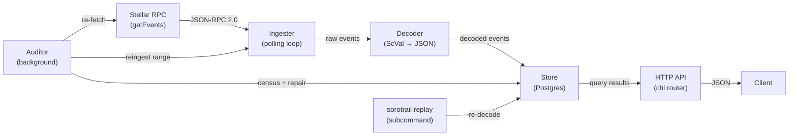
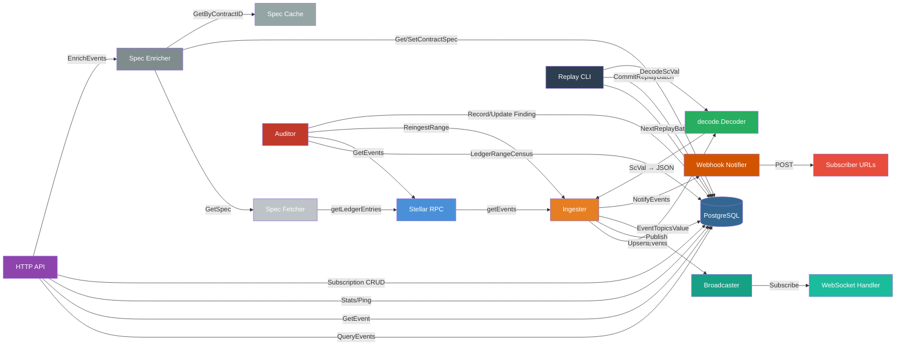

# SoroTrail Architecture

This document describes SoroTrail's internal structure, the data flow from
Stellar RPC to queryable API, and the design decisions that shaped each
component. It is the single place a newcomer should read to understand how
the pieces fit together.

## System overview

SoroTrail is a contract event indexer for the Stellar/Soroban network. It
polls a Stellar RPC endpoint, persists contract events durably in Postgres,
and serves them back through a queryable HTTP API. An optional background
auditor verifies stored data against fresh RPC fetches and auto-repairs
discrepancies.

```
┌─────────────────────────────────────────────────────────────────────┐
│                          sorotrail process                          │
│                                                                     │
│  ┌──────────┐    ┌──────────┐    ┌──────────┐    ┌──────────────┐  │
│  │ Ingester │───▶│ Decoder  │───▶│  Store   │◀───│   HTTP API   │  │
│  └────┬─────┘    └──────────┘    └────┬─────┘    └──────┬───────┘  │
│       │                               │                  │          │
│       │         ┌──────────┐          │                  │          │
│       │         │ Auditor  │──────────┘                  │          │
│       │         └────┬─────┘                             │          │
│       │              │                                   │          │
│       ▼              ▼                                   ▼          │
│  ┌──────────┐    ┌──────────┐                      ┌──────────┐    │
│  │ Stellar  │    │ Budget   │                      │   You    │    │
│  │   RPC    │    │ (rate    │                      │ (client) │    │
│  └──────────┘    │ limiter) │                      └──────────┘    │
│                  └──────────┘                                       │
│                                                                     │
│  ┌──────────┐                                                       │
│  │ Replay   │ (subcommand: sorotrail replay)                        │
│  └──────────┘                                                       │
└─────────────────────────────────────────────────────────────────────┘
```

### Data flow



The ingester polls the RPC at a configurable interval, pages events through
the decoder, and upserts them idempotently into Postgres. The HTTP API
serves stored events over chi. The auditor independently verifies stored
ranges against fresh RPC fetches and repairs mismatches. The replay
subcommand re-runs the decoder over raw XDR to apply decoder improvements
retroactively.

## Components

### `cmd/sorotrail` — entry point

The main binary. With no subcommand it runs the indexer (ingester + HTTP
API + optional auditor). The `replay` subcommand runs decoder replay.

Responsibilities:
- Load and validate configuration (`internal/config`)
- Run Postgres migrations
- Wire all components together via interfaces
- Start the ingester, HTTP API, and (optionally) auditor as concurrent goroutines
- Handle graceful shutdown on SIGINT/SIGTERM

### `internal/config` — configuration

Loads all runtime configuration from environment variables using
`env/v11`. Validates required fields (`DATABASE_URL`), URL formats, numeric
bounds, and contract ID shapes. The configuration struct is the single source
of truth for all tunables.

### `internal/rpc` — Stellar RPC client

A minimal JSON-RPC 2.0 client that wraps three methods the system needs:
`getEvents`, `getLatestLedger`, and `getHealth`. The client is defined as
an interface (`rpc.Client`) so the ingester, auditor, and API can be tested
with mocks.

Key behaviors:
- **Rate limiting**: requests are spaced ≥100ms apart by default (~10 req/s)
  to stay within public endpoint limits.
- **XDR format fallback**: the client initially requests `xdrFormat: "json"`
  for readable ScVal output; if the server rejects it (older nodes), it
  falls back to base64 XDR and decodes locally.
- **Budget splitting**: when the auditor is enabled, `rpc.Budget` splits the
  total request rate between the ingest pool and the audit pool via two
  independent token-bucket limiters.

### `internal/decode` — ScVal decoder

Converts Soroban ScVal payloads (base64 XDR or server-decoded JSON) into
queryable JSON objects. The `Decoder` interface is intentionally thin — a
single `DecodeScVal(base64XDR) → json.RawMessage` method.

The `XDRDecoder` implementation handles all ScVal types via a type switch in
`scValToGo`. Unhandled types fall through to a lossless
`{"unknown": {"type": ..., "base64": ...}}` wrapper, so ingestion never
stalls on exotic values.

The `EventTopicsValue` function orchestrates decoding for a complete event:
it prefers the RPC's own JSON fields (`topicJson`/`valueJson`) when
available and falls back to local XDR decoding.

### `internal/store` — persistence layer

Defines the `Store` interface — the persistence boundary that the ingester,
auditor, and API depend on, never Postgres directly. This abstraction
enables alternative storage backends without changing any consumer.

#### `store.Store` interface

| Method | Purpose |
|--------|---------|
| `UpsertEvents` | Idempotent insert (duplicates ignored); used by ingest |
| `ReplaceEventsInRange` | Atomic delete-orphan + insert-or-update; used by auditor repair |
| `GetEvent` | Single-event lookup by ID |
| `QueryEvents` | Paginated query with filter, cursor, and sort support |
| `LedgerRangeCensus` | Per-ledger event counts (and optionally IDs) for audit |
| `GetIngestionState` / `SaveIngestionState` | Persist the ingester's resume position |
| `GetAuditState` / `SaveAuditState` / `SaveAuditStateIfGreater` | Persist and advance the auditor's verified-through high-water mark |
| `ListWatchedContracts` / `AddWatchedContract` | Manage the watch list |
| `RecordAuditFinding` / `UpdateAuditFinding` / `ListOpenFindingsByRange` | Audit finding lifecycle |
| `Stats` | Aggregate statistics for `/stats` |
| `Ping` | Dependency health check |

#### Postgres backend (`store.Postgres`)

The only backend implemented today. Uses `pgx` (plain SQL, no ORM) with a
connection pool. Schema changes are managed via numbered migration pairs in
`internal/store/migrations/`.

**Schema highlights:**

| Table | Purpose |
|-------|---------|
| `events` | Contract events with decoded topics/value (JSONB), raw XDR columns, and indexes on `contract_id`, `ledger`, `created_at`, and a GIN index on `topics` |
| `ingestion_state` | Singleton row tracking the ingester's last ingested ledger and pagination cursor |
| `watched_contracts` | Contract IDs the operator wants to track |
| `audit_state` | Singleton row tracking the auditor's verified-through high-water mark |
| `audit_findings` | One row per discrepancy the auditor discovered, with status lifecycle |
| `replay_state` | Singleton row tracking the replay tool's progress |

#### `internal/replay` — decoder replay tool

Not part of the `Store` interface (so backends that don't need replay
aren't forced to implement it). Re-runs the current decoder pipeline over
stored raw XDR and rewrites the decoded columns in place.

Key properties:
- **Pure function of raw XDR**: nothing reads existing decoded columns
- **Batched and resumable**: each batch commits progress in the same
  transaction as its rewrites; Ctrl-C resumes on re-run
- **Idempotent**: running twice is a no-op
- **Live-safe**: short transactions, no table-level locks, no ingestion disruption
- **Advisory-locked**: only one replay at a time via `pg_try_advisory_lock`

### `internal/ingester` — polling loop

Runs the core ingestion loop: resolve resume position, fetch events from
the RPC, decode them, upsert into Postgres, persist state, repeat.

**Position resolution:**
1. If a saved pagination cursor exists → resume mid-page
2. If `LastIngestedLedger > 0` → warm start (ledger + 1)
3. Otherwise → cold start (`latest - RETENTION_LEDGERS`, clamped to RPC's
   oldest retained ledger)

**Filter batching:** The RPC caps filters at 5 per request and 5 contract
IDs per filter (max 25 watched contracts per request chain). With more
watched contracts, the ingester splits into multiple filter batches and
sweeps a bounded ledger window, each batch paging to completion in memory.

**Error handling:** Jittered exponential backoff on failures; the only
terminal condition is context cancellation. If the resume point falls outside
the RPC's retention window, the ingester logs a warning and skips ahead —
the gap is unrecoverable, which is the very problem SoroTrail exists to
prevent.

### `internal/audit` — background verifier

Walks recently-ingested ledger ranges (behind the ingest frontier, inside
the RPC's retention window) and re-fetches each range with the ingester's
exact filter configuration, comparing stored event counts and IDs against
the fresh response.

**Finding lifecycle:**
```
open ──▶ repaired (RPC agrees after repair)
  │
  ├──▶ unverifiable (range aged out of RPC retention)
  │
  └──▶ unrecoverable (RPC self-disagreement after max attempts)
```

**Budget management:** The auditor shares the total RPC request rate with
the ingester via `rpc.Budget`. By default, the audit pool gets 10% of the
budget and the ingest pool gets 90%.

**Lag pause:** The auditor sleeps until ingestion has moved at least
`AUDIT_LAG_THRESHOLD` ledgers past `verified_through_ledger`, so it never
races the ingester.

### `internal/api` — HTTP API

A chi-based HTTP server exposing the stored events. Read-only by design;
any write endpoints (e.g. managing watched contracts at runtime) should
come with authentication first.

**Endpoints:**

| Route | Purpose |
|-------|---------|
| `GET /health` | Checks database and RPC reachability |
| `GET /events` | Paginated event listing with filter support |
| `GET /events/{id}` | Single event by ID |
| `GET /contracts/{id}/events` | Convenience wrapper for contract-scoped queries |
| `GET /stats` | Aggregate counts and auditor metrics |

The API depends only on `store.Store` and `rpc.Client` (for `/health`),
never on concrete implementations.

## Key design decisions

### Why events are partitioned by ledger

Stellar's RPC returns events keyed by ledger sequence, and ledger order is
the natural chronological order for the chain. Partitioning by ledger
enables:

- **Efficient range scans**: the `idx_events_ledger` index supports fast
  `BETWEEN` queries for time-range and ledger-range filters.
- **Audit reconciliation**: the auditor compares per-ledger event counts
  between the store and a fresh RPC fetch. Ledger-level granularity makes
  mismatches tractable — a single finding is bounded to a small window.
- **Idempotent upserts**: events are deduplicated by their RPC-assigned
  TOID-based ID, which encodes ledger sequence. Re-scans after crashes
  never create duplicates.
- **Retention window alignment**: the RPC's own retention is expressed in
  ledgers, so the ingester's cold-start reach-back and the auditor's
  verification window map directly to ledger ranges.

### Why the cursor model works the way it does

SoroTrail uses two kinds of cursors for two different purposes:

1. **Ingestion cursor** (`ingestion_state.last_cursor`): an opaque
   pagination token from the RPC's `getEvents` response. When set, the
   ingester resumes mid-page without specifying a `startLedger` (the RPC
   rejects requests that carry both). This is critical for large backfills
   where a single page takes many seconds — each page commits durable
   progress so even a crash loses at most one page of work.

2. **Query cursor** (`/events?cursor=`): the TOID-based event ID from the
   last event in a page. Because TOIDs are zero-padded, their
   lexicographic order matches chronological order, so `id > cursor` walks
   events forward (or `id < cursor` for descending). This gives stable,
   keyset-based pagination that doesn't degrade with offset size.

The ingestion cursor is preferred over re-scanning from `latest + 1`
because `startLedger` must stay within the RPC's retained range, and
`latest + 1` is always rejected. Only when no cursor is available (empty
page, old server) does the ingester fall back to ledger-based resumption —
idempotent upserts make the one-ledger overlap harmless.

### Why Scope fails closed

Several boundaries in SoroTrail are designed to fail closed — that is,
when something goes wrong, the system conservatively refuses to serve or
ingest rather than silently producing incorrect results:

- **Ledger out of range**: if the RPC reports the requested `startLedger`
  is outside its retention window, the ingester skips ahead rather than
  serving stale or partial data. The gap is logged as a warning.

- **Audit findings**: when the auditor cannot determine whether stored
  data is correct (e.g. the RPC returns inconsistent results across
  fetches, or the range has aged out of retention), the finding stays
  visible with a terminal status (`unrecoverable` or `unverifiable`)
  rather than being silently cleared. Operators see it via `/stats`.

- **Decoder fallback**: unknown ScVal types produce a lossless
  `{"unknown": {...}}` wrapper instead of erroring, so ingestion never
  stalls — but the data is clearly marked as not fully decoded.

- **Health endpoint**: `/health` returns `503` if either the database or
  RPC is unreachable, so load balancers and operators get an honest signal.

- **Replay locking**: a session-level Postgres advisory lock prevents two
  replays from running concurrently. The `try` lock fails immediately
  rather than queueing, so a second replay surfaces the conflict instead
  of silently interleaving writes.

## Store abstraction and backends

The `store.Store` interface is the persistence boundary. It is designed so
that each method is independently testable and replaceable:

- **Postgres** (`store.Postgres`): the only backend implemented today.
  Uses `pgx` with plain SQL. Migrations are numbered pairs in
  `internal/store/migrations/`.

- **Alternative backends**: the interface is intentionally minimal. A
  contributor can implement `Store` for SQLite, DynamoDB, or any other
  persistence layer. The contract requires `QueryEvents` to return events
  in ascending ID order for cursor pagination to work.

Replay-specific persistence (`store.ReplayLock`, `GetReplayState`, etc.) is
deliberately **not** part of the `Store` interface. It lives on
`*store.Postgres` and is consumed through the narrower `replay.Store`
interface, so backends that don't need the maintenance replay tool aren't
forced to implement one.

## What's implemented today

| Component | Status |
|-----------|--------|
| Stellar RPC client | ✅ Complete — `getEvents`, `getLatestLedger`, `getHealth` |
| XDR decoder | ✅ Complete — all ScVal types handled, lossless fallback |
| Postgres store | ✅ Complete — full `Store` interface implemented |
| Ingester | ✅ Complete — cold/warm start, filter batching, backoff |
| HTTP API | ✅ Complete — events, health, stats, contract queries |
| Auditor | ✅ Complete — verification, auto-repair, finding lifecycle |
| Replay tool | ✅ Complete — batched, resumable, idempotent, advisory-locked |
| Rate limiting / budget | ✅ Complete — shared budget between ingest and audit |

## What's aspirational (not yet implemented)

The following are mentioned in the README roadmap or CONTRIBUTING.md but
do **not** exist in the codebase yet:

- **Per-standard event decoders** (e.g. SEP-41 token transfers) on top of
  `decode.Decoder`. The `Decoder` interface and `ReplayBatch` extension
  point are ready, but no standard-specific decoder is implemented.
- **More than 25 watched contracts** with smarter scheduling (parallel
  sweeps, per-contract cursors). The windowed sweep handles this today
  but sequentially.
- **GraphQL / WebSocket subscriptions** for real-time event streaming.
- **Metrics (Prometheus) and tracing** for production observability.
- **Alternative storage backends** behind `store.Store`.
- **Runtime watched-contract management** via the API (would require
  authentication).

## Package dependency graph

```
cmd/sorotrail
  ├── internal/config
  ├── internal/store
  ├── internal/rpc
  ├── internal/decode
  ├── internal/ingester
  │     ├── internal/rpc      (rpc.Client)
  │     ├── internal/store    (store.Store)
  │     └── internal/decode   (decode.Decoder)
  ├── internal/api
  │     ├── internal/store    (store.Store)
  │     ├── internal/rpc      (rpc.Client)
  │     └── internal/audit    (for /stats)
  └── internal/audit
        ├── internal/rpc      (rpc.Client)
        ├── internal/store    (store.Store)
        └── internal/ingester (Reingester interface)

internal/replay
  ├── internal/decode         (decode.Decoder)
  └── internal/store          (replay.Store — narrower than store.Store)
```

No circular dependencies. Each package depends only on interfaces from its
neighbors, so the whole graph is independently testable.
## Overview

SoroTrail is a contract event indexer for the Stellar/Soroban network. It polls
a Stellar RPC endpoint for contract events, stores them durably in PostgreSQL,
and serves them back through a queryable HTTP API long after the RPC has dropped
them (RPC retention is only ~24 hours to 7 days).

## Data Flow



## Component Descriptions

### [`cmd/sorotrail`](../cmd/sorotrail/main.go) — Main entrypoint

Wires all dependencies, runs database migrations, then starts four goroutines:

1. **Ingester** — polling loop (blocking until context cancel)
2. **HTTP API** — `http.Server` listening on the configured address
3. **Webhook notifier** — background worker pool draining the delivery queue
4. **Auditor** (optional, `AUDIT_ENABLED=true`) — background ledger verifier

Graceful shutdown catches SIGINT/SIGTERM: the server stops accepting new
connections, all goroutines drain, and the process exits once all components
have stopped.

### [`internal/rpc`](../internal/rpc/) — Stellar RPC client

Interface `rpc.Client` wraps the Stellar Soroban RPC JSON-RPC 2.0 methods:

- `GetEvents` — paginated event queries with filter batching (up to 5
  contract IDs per filter, up to 5 filters per request, max 25 watched
  contracts per request chain)
- `GetHealth` — latest/oldest ledger, server health status
- `GetLatestLedger` — current sequence number
- `GetLedgerEntries` — raw ledger entries (used by the spec fetcher)

The client handles JSON-RPC framing, error wrapping (including
`LedgerOutOfRange` for retention-boundary logic), and supports both
`xdrFormat: "json"` (server-decoded) and base64 XDR responses.

**Extension interface:** `rpc.Client` — add new RPC methods here as the
ingester or API needs them; the client is deliberately not a full RPC SDK.

### [`internal/decode`](../internal/decode/) — ScVal decoder

Interface `decode.Decoder` has a single method `DecodeScVal(base64XDR string)`
that converts a base64-encoded XDR ScVal into a JSON `json.RawMessage`.

The default `XDRDecoder` (in `xdr.go`) handles all Soroban ScVal types:
`scvBool`, `scvVoid`, `scvI32`, `scvU32`, `scvI64`, `scvU64`, `scvI128`,
`scvU128`, `scvI256`, `scvU256`, `scvSymbol`, `scvBitset`, `scvStatus`,
`scvBytes`, `scvAddress`, `scvString`, `scvVec`, `scvMap`, `scvContractInstance`,
`scvLedgerKeyContractInstance`, `scvTimePoint`, `scvDuration`, `scvUdt`,
and `scvError`.

When the RPC returns `xdrFormat: "json"`, the server-decoded `topicJson` /
`valueJson` fields are used verbatim — the decoder is only invoked for
base64 XDR payloads.

**Extension interface:** `decode.Decoder` — implement for richer decoding
(e.g., custom type handling), or build per-standard decoders (SEP-41 token
events, etc.) as layers on top of the stored JSON.

### [`internal/store`](../internal/store/) — Persistence layer

Interface `store.Store` abstracts all database operations behind an interface
so alternative backends can be contributed without changing the ingester or API.

Key methods:

| Method | Used by | Purpose |
| --- | --- | --- |
| `UpsertEvents` | Ingester | Idempotent insert (ON CONFLICT DO NOTHING) |
| `ReplaceEventsInRange` | Auditor | Delete-and-reinsert for repair (ON CONFLICT DO UPDATE) |
| `GetEvent` / `EventExists` | API | Single-event lookup with conditional GET support |
| `QueryEvents` | API | Paginated filtered queries, ascending/descending |
| `GetIngestionState` / `SaveIngestionState` | Ingester | Resume cursor persistence |
| `GetAuditState` / `SaveAuditStateIfGreater` | Auditor | Verification high-water mark |
| `LedgerRangeCensus` | Auditor | Per-ledger event counts/IDs for reconciliation |
| `CreateSubscription` / … | API | Webhook subscription CRUD |
| `ListEnabledSubscriptions` | Webhook | Delivery routing |
| `RecordDeliveryAttempt` / `ListDeliveryAttempts` | Webhook | Delivery history |
| `GetContractSpec` / `SetContractSpec` | Spec cache | Wasm spec persistence |
| `RecordAuditFinding` / `UpdateAuditFinding` | Auditor | Finding lifecycle |
| `Stats` | API | Aggregate counters |
| `Ping` | API | Health check |

The PostgreSQL implementation (`*Postgres`) also provides replay-specific
persistence (`AcquireReplayLock`, `GetReplayState`, `NextReplayBatch`,
`CommitReplayBatch`) through a narrower interface consumed by
`internal/replay`.

The `events` table is **partitioned by ledger range** (default span:
120,960 ledgers ≈ 7 days). Partition creation is automatic via the
`ensure_event_partitions()` PL/pgSQL function, called before every batch
insert.

The indexes on `events` are chosen and documented for the query shapes the
read endpoints issue — see [Indexing](indexes.md) for the index strategy and
rationale.

**Extension interface:** `store.Store` — implement the full interface to
swap in an alternative storage backend.

### [`internal/ingester`](../internal/ingester/) — Polling loop

The `Ingester` runs the core ingestion cycle:

1. **Resolve position** — read the persisted cursor or last ingested
   ledger from `ingestion_state`. On cold start, fall back to
   `latest − RETENTION_LEDGERS` (default ~24h), clamped to the RPC's
   oldest retained ledger.
2. **Build filter batches** — read the watched-contract list and group
   contract IDs into RPC-compliant filter batches (≤5 per filter, ≤5
   filters per request). An empty watch list produces a single
   `type: "contract"` filter that captures all contract events.
3. **Page through RPC** — call `GetEvents` with the resume cursor,
   decoding each event via `decode.EventTopicsValue`.
4. **Persist** — upsert decoded events into the store, then advance
   the ingestion state cursor.
5. **Notify** — fire the `EventNotifier` (webhook delivery) and
   `Broadcaster` (WebSocket stream) after each successful batch.

Two pagination strategies handle different watch-list sizes:

- **Single-page** (≤25 watched contracts): one `getEvents` call per
  pass; cursor-based resumption for fine-grained progress.
- **Window sweep** (>25 watched contracts): each filter batch pages
  through a bounded ledger window (default 1000 ledgers) independently,
  then advances the state past the window. Idempotent upserts make
  re-scanning on crash harmless.

Errors are retried with jittered exponential backoff (1s → 2s → 4s …
→ `MaxBackoff`). If the resume point ages out of RPC retention, the
ingester logs a warning and skips ahead to the oldest retained ledger.

**Extension interface:** `ingester.EventNotifier` — attach post-ingest
hooks (webhook delivery, SSE, etc.) without modifying the loop.

### [`internal/broadcast`](../internal/broadcast/) — Pub-sub stream

The `Broadcaster` distributes ingested events to live subscribers (WebSocket
connections). Each subscriber registers with a `store.EventFilter` and receives
matching events on a buffered channel (default: 64 events). Slow consumers are
silently evicted to prevent back-pressure on the ingester.

- `Subscribe(filter)` — returns a `Subscription` with a read-only
  `Events()` channel.
- `Publish(ctx, events)` — fans out to all subscribers whose filter
  matches; drops subscribers whose channel is full.
- `SubscriberCount()` — observable metric for operators.

The broadcaster is wired in `main.go` and consumed by the WebSocket
handler (`GET /events/ws`).

### [`internal/webhook`](../internal/webhook/) — Async delivery

The `Notifier` implements `ingester.EventNotifier` and delivers events to
registered webhook subscriptions asynchronously:

- **Queue**: buffered channel (4096 tasks), 4 concurrent workers.
- **HMAC signing**: every POST carries `X-SoroTrail-Signature` — the
  hex-encoded HMAC-SHA256 digest of the body, keyed with the
  subscription's secret.
- **Retry**: exponential backoff (1s → 2s → 4s → 8s → 16s), up to 5
  attempts.
- **Auto-disable**: after 5 consecutive failures, the subscription is
  disabled automatically. A successful delivery resets the failure
  counter.
- **Delivery history**: every attempt is recorded in `delivery_attempts`
  and queryable via `GET /subscriptions/{id}/deliveries`.

### [`internal/audit`](../internal/audit/) — Background verifier

The `Auditor` (optional, enabled via `AUDIT_ENABLED=true`) walks
recently-ingested ledger ranges behind the ingest frontier and reconciles
stored events against fresh RPC fetches:

1. **Lag pause**: sleeps until ingestion is at least `AUDIT_LAG_THRESHOLD`
   (default 200) ledgers ahead of the verified mark.
2. **Reconcile**: fetches the RPC's events for `[from, to]` using the
   *exact same filter batches* as the ingester, compares per-ledger
   counts, and advances the verified HWM over clean prefixes.
3. **Findings**: mismatches (missing events, orphans, count disagreement)
   are recorded in `audit_findings` and auto-repaired via
   `Ingester.ReingestRange`.
4. **Repair limits**: after `AUDIT_MAX_REPAIR_ATTEMPTS` (default 3)
   iterations without convergence, the finding moves to `unrecoverable`
   so operators can investigate.
5. **Retention edges**: if a finding's range ages out of RPC retention,
   it moves to `unverifiable` rather than looping forever.

The auditor shares the RPC request budget with the ingester via
`rpc.Budget`; the audit pool gets `AUDIT_BUDGET_SHARE` (default 10%) and
the ingest pool gets the remainder.

### [`internal/replay`](../internal/replay/) — Decoder replay

The `Replayer` (`sorotrail replay` subcommand) re-runs the current decoder
pipeline over stored raw XDR and rewrites the decoded columns. This applies
decoder improvements to already-indexed events without re-fetching from RPC.

Key design properties:

- **Pure function**: output depends only on raw XDR, never on the
  current decoded columns (except to detect changes).
- **Batched & resumable**: progress is persisted in the same transaction
  as rewrites; Ctrl-C stops cleanly, and re-running resumes where it
  left off.
- **Idempotent**: a row whose decoding hasn't changed is not rewritten.
- **Safe for live DB**: short transactions hold no table-level locks;
  concurrent ingestion is never blocked.
- **Advisory lock**: a PostgreSQL session-level advisory lock (key:
  `"SoroRepl"`) prevents two replays from running simultaneously.
  The lock auto-releases if the process dies.

### [`internal/spec`](../internal/spec/) — Contract spec enrichment

The `Enricher` attaches human-readable field names to events by fetching
and parsing the contract's Wasm spec entries:

1. **Fetch**: `Fetcher.FetchSpec` walks `contract ID → LedgerKeyContractData
   → wasm_hash → LedgerKeyContractCode → Wasm blob → `contractspecv0`
   custom section → XDR-parsed `[]ScSpecEntry`.
2. **Cache**: `Cache` stores parsed specs in-memory (`sync.Map`-backed)
   and durably in the `contract_specs` table.
3. **Enrich**: `Enricher.EnrichEvents` matches `topic[0]` (the event name
   symbol) to a spec entry, then maps positional topics and value to named
   fields.

Enrichment is opt-in: the API returns it when `?decoded=true` is set. Events
for contracts without a cached spec are returned with `decoded: false`.

### [`internal/config`](../internal/config/) — Configuration

All configuration is loaded from environment variables (via
`caarlos0/env`) at startup. See the [README configuration table](../README.md#configuration)
for the full list.

## Database Schema

The core tables (managed via numbered migrations in
[`internal/store/migrations/`](../internal/store/migrations/)):

| Table | Purpose |
| --- | --- |
| `events` | Partitioned by ledger range, stores decoded event data and raw XDR |
| `ingestion_state` | Singleton row tracking the ingester's resume cursor |
| `audit_state` | Singleton row tracking the auditor's verified HWM |
| `audit_findings` | Mismatches found and (un)repaired by the auditor |
| `watched_contracts` | Contract IDs the ingester should poll |
| `subscriptions` | Webhook callback registrations |
| `delivery_attempts` | Per-event delivery history |
| `contract_specs` | Parsed Wasm spec entries, keyed by wasm_hash |
| `replay_state` | Singleton row tracking decoder-replay progress |

## API Reference

The README API reference is the source of truth — every endpoint
includes its params table, a curl example, and an example JSON response
captured from a real local run. The table below is a quick index of
the same endpoints so a reader skimming this document can see the
surface at a glance.

### Endpoint summary

| Method | Path | Description |
| --- | --- | --- |
| `GET` | `/health` | Dependency health (DB + RPC) |
| `GET` | `/events` | Paginated, filtered event list |
| `GET` | `/events/{id}` | Single event by TOID |
| `GET` | `/contracts/{id}/events` | Events scoped to one contract |
| `GET` | `/events/ws` | WebSocket live stream |
| `GET` | `/stats` | Aggregate counters + audit metrics |
| `POST` | `/subscriptions` | Create webhook subscription |
| `GET` | `/subscriptions` | List all subscriptions |
| `GET` | `/subscriptions/{id}` | Get one subscription |
| `PUT` | `/subscriptions/{id}` | Update subscription fields |
| `DELETE` | `/subscriptions/{id}` | Delete subscription (204) |
| `GET` | `/subscriptions/{id}/deliveries` | Delivery attempt history |

## Extension points

- **`decode.Decoder`** — implement for new ScVal type handling
- **`store.Store`** — implement for alternative storage backends
- **`rpc.Client`** — add new RPC methods as needed
- **`ingester.EventNotifier`** — post-ingest hooks (webhooks, SSE, etc.)
- **Per-standard decoders** (SEP-41, etc.) — build on stored JSON, wire
  into `store.ReplayBatch` for backfill support
- **New API endpoints** — add routes in `internal/api/server.go`
- **Database migrations** — add numbered pairs to
  `internal/store/migrations/`

## Caching strategy

- **Single events** (`GET /events/{id}`): `Cache-Control: public,
  max-age=31536000, immutable` with a strong ETag (the event ID itself).
  Conditional GETs return 304 without re-serializing the row.
- **List pages** (`GET /events`, `GET /contracts/{id}/events`): a page
  whose `to_ledger` sits *strictly below* the ingest frontier is
  immutable. Open-ended or frontier-crossing pages get `no-cache` — the
  conservative choice.
- **Operational endpoints** (`/health`, `/stats`): `no-store` so
  monitoring sees real state.

See the [README caching section](../README.md#caching) for the full
rationale, including the `CACHE_PRIVATE` flag for auth'd deployments.

## Data integrity

The background auditor provides the strongest trust signal SoroTrail can
offer: `verified_through_ledger` in `/stats` names the highest ledger
whose stored events have been verified against the RPC, not merely
ingested. See the [Data integrity section](../README.md#data-integrity)
for the auditor's contract and edge-case handling.
